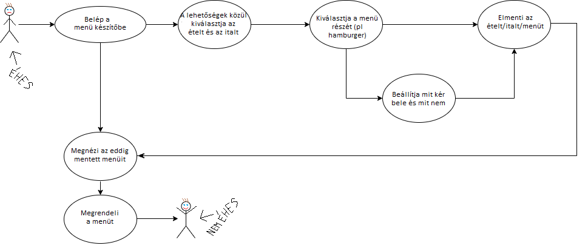

## 1. Rendszer célja
A rendszer célja egy ablakos alkalmazás amiel különböző hamburgereket és italokat tudunk összerakni és ezután megrendelni.
Az alkalmazás használatához szükségünk lesz egy felhasználói fiókra, hogy bejelentkezzünk és ezután össze tudjuk rakni a következő ebédünket avagy vacsoránkat.
Az elkészített menüket meg tudjuk rendelni. Ezt a rendelést rögzíteni fogjuk az adatázisba.
Az alkalmazás ingyenesen elérhető lesz.

## 2. Üzleti folyamatok modellje


## 3. Követelmények

**Funkcionális követelmények**
  - **Felhasználók adatainak tárolása**
  - **Felhasználók tudjanak menüket szerkeszteni**
  - **Felhasználók tudják a megrendelt menüket megtekinteni**

  **Nem funkcionális követelmények**
  - **A felhasználók nem férnek hozzá egymás adataihoz**

  **Törvényi előírások, szabványok:**
  - **GDPR-nek való megfelelés**

## 4. Funkcionális terv

**Rendszerszereplők:**
  - **Felhasználó**
  - **Vendég**

  **Rendszerhasználati esetek és lefutásaik:**
  - **Vendég**
    - **Képes regisztrálni és bejelentkezni**

  - **Felhasználó**
    - **Készíthet új menüt**
    - **Megtekintheti a megrendelt menüt**

  - **Menü-hierarchiák:**
    - **Bejelentkezés**
    - **Regisztráció**
    - **Menü készítés**

    - **Bejelentkezés után:**
      - **Menük szerkesztése**
      - **Megrendelt menük megtekintése**
      - **Kijelentkezés**

## 5. Fizikai környezet
- **Feljeszői környezet:**
    - **IntelliJ Idea**
    - **Git**
    - **MySQL/Xampp**
    - **UML**


## 6. Architekturális terv
- **Felhasznált technológiák:**
 1. MySQL:
    A MySQL kezeli az adatbázisunkat, itt tároljuk el az adatokat.
    A program "query"-n keresztül kommunikál az adatbázissal, lekérdezéseket, müveleket végez el benne.
    XAMPP-al vezérelt, localhost-on elérhető.
  2. Java:
  A fejlesztés IntelliJ Idea fejlesztői környezetben folyik a programozás.
  A program logolásához SLF4J-t használunk.

## 7. Adatbázis terv

### **Táblák**
- **users:** Minden felhasználó, aki regisztrált
  - **id:** Azonosító szám, mindenképp felvesz egy egész típusú értéket, amit a rendszer automatikusan generál és egyesével növekszik, nem lehet két azonos szám
  - **username:** A felhasználók regisztrációkor megadott neve, nem lehet üres
  - **password:** Nem lehet üres a mező, legalább 8 karakter

- **orders:** Felhasználó-menü összekötőtábla
  - **id:** Azonosító szám, mindenképp felvesz egy egész típusú értéket, amit a rendszer automatikusan generál és egyesével növekszik, nem lehet két azonos szám
  - **uid:** A felhasználó id-je
  - **sid:** A menü id-je

  Work in progress
  
**DSL**

```

```

**UML**


## 8. Implementációs terv:
  Az alkalmazás Windows operációs rendszerre készül IntelliJ Idea-ban, Java nyelven.
  


A képen látható osztályok felépítése és megnevezése még változhat.

## 9. Tesztterv:
**Unit teszt:**
A metódusok működésének ellenőrzésére unit teszteket kell írni.
A metódusoknak át kell mennie a ezen teszteken, hogy elkészültnek tekintsük.

## 10. Telepítési terv
Telepítő futtatása (készül)